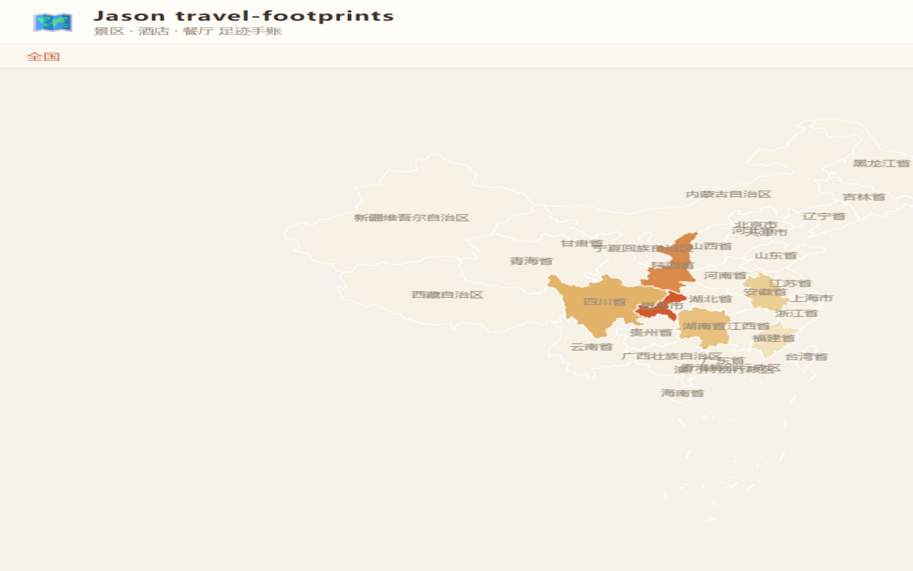
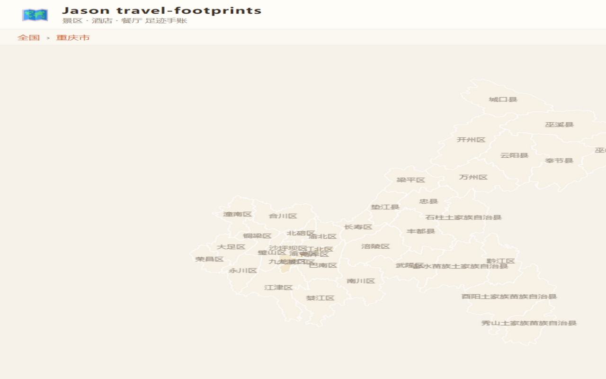

# Jason travel-footprints

一个纯前端的旅行足迹网站：把去过的景区、住过的酒店、吃过的餐厅，按 全国 → 省 → 市 → 县 整理在地图上。

- 全国地图点击省份逐级下钻，去过的省自动涂色
- 每条记录含评分、消费、推荐理由、标签、图片
- 数据由作者在本地维护后发布为本站只读快照

点击省份即可下钻到市县：

技术：原生 HTML/CSS/JS + ECharts，地图边界来自[阿里 DataV](https://datav.aliyun.com/portal/school/atlas/area_selector)。

## 在线访问

<https://takajie6223-cloud.github.io/travel-footprints/>
